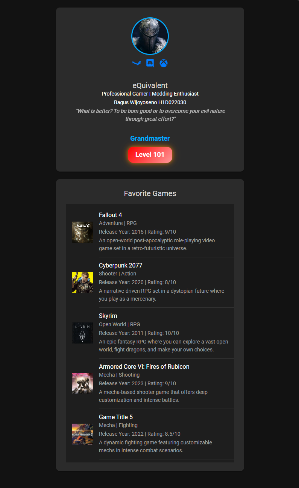

# LabMobile6_BagusWijoyoseno_D
Bagus Wijoyoseno

H1D022030

Shift D

## Screenshot


## Langkah
Komponen yang ditambahkan adalah menu dengan daftar item. Berikut adalah cara menambahkannya:
1. Kunjungi Ionic Documentation - Card dan Ionic Documentation - List.
2. Salin kode dari segment Basic Usage ke dalam file app.component.html.
3. Kustomisasi hingga didapatkan kode yang diinginkan.

## Kode

### Profile Card
```
<ion-card class="profile-card">
  <!-- First Section: Profile Image and Social Icons -->
  <ion-card-header class="profile-header">
    <div class="profile-image-section">
      
      <div class="social-icons">
        <a href="https://steamcommunity.com/id/-eQuivalent/" target="_blank">
          <ion-icon name="logo-steam"></ion-icon>
        </a>
        <ion-icon name="logo-discord"></ion-icon>
        <ion-icon name="logo-xbox"></ion-icon>
      </div>
    </div>
  </ion-card-header>

  <!-- Second Section: Username and Description -->
  <ion-card-content class="profile-info-section">
    <ion-card-title class="username">eQuivalent</ion-card-title>
    <p class="description">Professional Gamer | Modding Enthusiast</p>
    <p class="description">Bagus Wijoyoseno H1D022030</p>
    <p class="description" style="font-style: italic; opacity: 0.7;">
      "What is better? To be born good or to overcome your evil nature through great effort?"
    </p>
  </ion-card-content>

  <!-- Third Section: Title and Level -->
  <ion-card-content class="level-section">
    <div class="level-badge">
      <div class="title">Grandmaster</div>
      <div class="level">Level 101</div>
    </div>
  </ion-card-content>
</ion-card>
```

### Game List Card
```
<ion-card class="game-card">
  <ion-card-content>
    <ion-list>
      <!-- Game 1 -->
      <ion-item class="game-item">
        <ion-thumbnail slot="start" class="game-thumbnail">
          
        </ion-thumbnail>
        <ion-label>
          <h2 class="game-title">Fallout 4</h2>
          <p class="game-subtitle">Adventure | RPG</p>
          <p class="game-details">Release Year: 2015 | Rating: 9/10</p>
          <p class="game-description">An open-world post-apocalyptic role-playing video game set in a retro-futuristic universe.</p>
        </ion-label>
      </ion-item>

      <!-- Game 2 -->
      <ion-item class="game-item">
        <ion-thumbnail slot="start" class="game-thumbnail">
          
        </ion-thumbnail>
        <ion-label>
          <h2 class="game-title">Cyberpunk 2077</h2>
          <p class="game-subtitle">Shooter | Action</p>
          <p class="game-details">Release Year: 2020 | Rating: 8/10</p>
          <p class="game-description">A narrative-driven RPG set in a dystopian future where you play as a mercenary.</p>
        </ion-label>
      </ion-item>

      <!-- Game 3 -->
      <ion-item class="game-item">
        <ion-thumbnail slot="start" class="game-thumbnail">
          
        </ion-thumbnail>
        <ion-label>
          <h2 class="game-title">Skyrim</h2>
          <p class="game-subtitle">Open World | RPG</p>
          <p class="game-details">Release Year: 2011 | Rating: 10/10</p>
          <p class="game-description">An epic fantasy RPG where you can explore a vast open world, fight dragons, and make your own choices.</p>
        </ion-label>
      </ion-item>

      <!-- Game 4 -->
      <ion-item class="game-item">
        <ion-thumbnail slot="start" class="game-thumbnail">
          
        </ion-thumbnail>
        <ion-label>
          <h2 class="game-title">Armored Core VI: Fires of Rubicon</h2>
          <p class="game-subtitle">Mecha | Shooting</p>
          <p class="game-details">Release Year: 2023 | Rating: 9/10</p>
          <p class="game-description">A mecha-based shooter game that offers deep customization and intense battles.</p>
        </ion-label>
      </ion-item>

      <!-- Game 5 -->
      <ion-item class="game-item">
        <ion-thumbnail slot="start" class="game-thumbnail">
          
        </ion-thumbnail>
        <ion-label>
          <h2 class="game-title">Game Title 5</h2>
          <p class="game-subtitle">Mecha | Fighting</p>
          <p class="game-details">Release Year: 2022 | Rating: 8.5/10</p>
          <p class="game-description">A dynamic fighting game featuring customizable mechs in intense combat scenarios.</p>
        </ion-label>
      </ion-item>
    </ion-list>
  </ion-card-content>
</ion-card>
```
